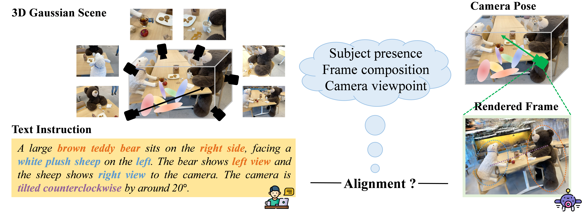
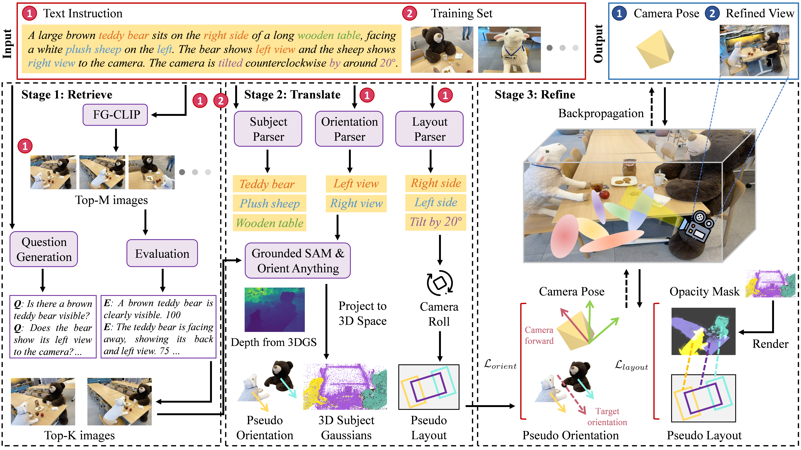
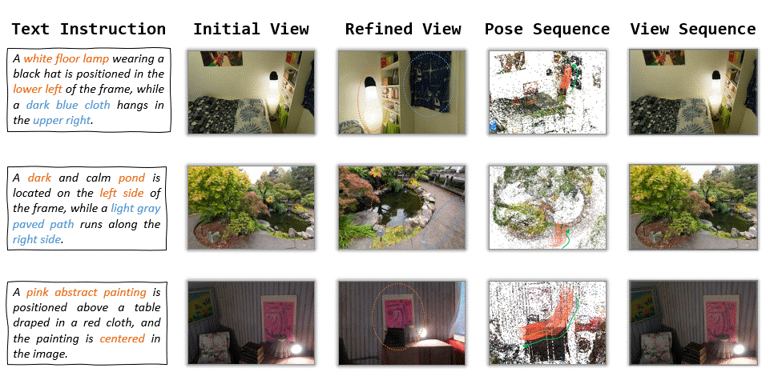

# CapFrame: Text-Instructed Viewpoint Grounding in 3D Gaussian Scenes via Geometric Pseudo-Labels

Jirong Li<sup>1</sup>, Satoshi Ikehata<sup>2,3</sup>, Shuhei Kurita<sup>1,3</sup>, and Ikuro Sato<sup>1,2</sup>

<sup>1</sup> Institute of Science Tokyo  <sup>2</sup> DENSO IT Laboratory, Inc.  <sup>3</sup> National Institute of Informatics

[](https://arxiv.org/abs/2608.30342)
[](https://github.com/jirongli/CapFrame)
[](https://youtu.be/FaLQmc9m5jg)

Text-Instructed Viewpoint Grounding aims to identify a 6-DoF camera pose in a 3D Gaussian scene such that the rendered frame matches a text instruction in terms of subject presence, frame composition, and camera viewpoint.



To address this task, CapFrame grounds camera viewpoints from text instructions through a **Retrieve–Translate–Refine** pipeline, ultimately capturing a frame in the 3D Gaussian scene that fulfills the user's intent.



The following examples illustrate the camera refinement process and the resulting view sequence.

<p align="center">
  
</p>

## ⚙️ Installation

Clone the repository:

```bash
git clone https://github.com/jirongli/CapFrame
cd CapFrame
```

Create the environment:

```bash
conda create -n capframe python=3.11
conda activate capframe
pip install -r requirements.txt
```

Install the CUDA extensions required by 3D Gaussian Splatting:

```bash
cd CameraGS
pip install submodules/diff-gaussian-rasterization
pip install submodules/simple-knn
```

## 💾 Pretrained Models

Download the pretrained **FG-CLIP-Base** checkpoint from [Hugging Face](https://huggingface.co/qihoo360/fg-clip-base). Then set `model_root` in `configs/arguments.py` to the directory containing the downloaded checkpoint. The pretrained weights for Orient Anything, Grounded SAM, and Qwen3-VL will be downloaded automatically when the code is run for the first time.

## 🔮 Prepare a 3D Gaussian Scene

Create a `3DGS_scene` directory in the root directory. Place the source images and camera parameters under `3DGS_scene/dataset`, and store the corresponding trained 3D Gaussian Splatting outputs under `3DGS_scene/output`. The expected directory structure is:

```text
3DGS_scene/
├── dataset/
│   └── <dataset>/<scene>/
│       ├── images/
│       └── sparse/
└── output/
    └── <dataset>/<scene>/
        ├── cfg_args
        ├── point_cloud/
        └── cameras.json
```

For example, `<dataset>/<scene>` may be `lerf_ovs/teatime`. The `lerf_ovs` dataset is from [LERF](https://github.com/kerrj/lerf). Two example scenes from the `lerf_ovs` dataset are available for download [here](https://drive.google.com/file/d/13mJwD7qSEusNOBvYJ4BVlpTPPfBAJbfe/view?usp=drive_link).

> **Note:** If the scene's up direction is not aligned with the negative Y-axis of the COLMAP coordinate, the 3D scene may be tilted. In this case, use COLMAP's `model_orientation_aligner` to perform Manhattan-world alignment.

## 📷 Capture a Frame

### 1. Configure the scene and text instruction

Edit `configs/default.py` and specify:

- `model_path`: path to the trained 3D Gaussian Splatting scene.
- `source_path`: path to the corresponding source image directory.
- `render_path`, `camera_R_path`, and `camera_T_path`: output paths for the rendered frames and optimized camera poses.
- `user_input`: text description of desired target frame.

### 2. Adjust optimization settings (Optional)

The main optimization settings are defined in `configs/arguments.py`:

- `score_threshold` and `filter_fgclip` control the initial pose selection in Stage 1.
- `opt_steps` and `converge` control the optimization process in Stage 3.
- `camera_vertical` constrains the camera up direction to remain perpendicular to the ground plane.

### 3. Run CapFrame

```bash
python optimize.py
```

Rendered frames and optimized camera poses are saved to the paths specified in `configs/default.py`.

## Citation

If you find this work useful, we would appreciate a citation:
<!-- TODO: Add the BibTeX entry. -->
```bibtex
@article{li2026capframe,
  title   = {CapFrame: Text-Instructed Viewpoint Grounding in 3D Gaussian Scenes via Geometric Pseudo Labels},
  author  = {Jirong Li, Satoshi Ikehata, Shuhei Kurita, Ikuro Sato},
  journal = {arXiv preprint arXiv:2608.30342},
  year    = {2026}
}
```

## Acknowledgements

This project builds upon several excellent open-source projects, including [3D Gaussian Splatting](https://github.com/graphdeco-inria/gaussian-splatting), [MonoGS](https://github.com/muskie82/MonoGS), [Orient Anything](https://github.com/SpatialVision/Orient-Anything), [Grounded SAM](https://github.com/idea-research/grounded-segment-anything), [FG-CLIP](https://github.com/360CVGroup/FG-CLIP), and [Qwen3-VL](https://github.com/qwenlm/qwen3-vl). We sincerely thank their authors for making their work publicly available.
